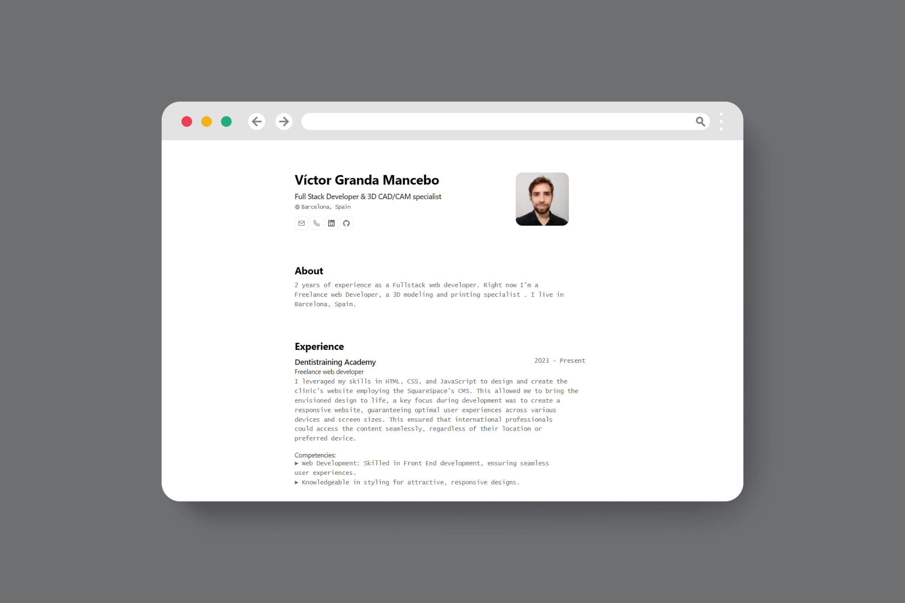

<div align="center">
<h2>
    Minimalist<em> Portfolio </em>for web and pdf display
</h2>
<p>
The JSON Resume schema is a JSON-based format for representing a candidate's or job seeker's resume. It provides a standardized structure for representing various types of data, such as contact information, education, work experience, and skills. The schema is defined by the JSON Resume organization and is widely used in the industry. <a href="https://jsonresume.org/schema/">jsonresume.org</a>
</p>

<p>
Based in the design of <a href="https://github.com/BartoszJarocki/cv">Bartosz Jarocki</a>
</p>
<p>Visit the <a href="https://victorgrandaportfolio.netlify.app/">Portfolio</a></p>

</img>

### Make your own CV:

Edit the `cv.json` if you want to make your own printable Portfolio/CV .

</div>

## 🛠️ Stack

- [**Astro**](https://astro.build/) - The web framework for content-driven websites.
- [**Typescript**](https://www.typescriptlang.org/) - JS on steroids
- [**Ninja Keys**](https://github.com/ssleptsov/ninja-keys) - Keyboard shortcut interface for your website that works with Vanilla JS, Vue, and React.

## 🚀 Project Structure

Inside of your Astro project, you'll see the following folders and files:

```text
/
├── public/
│   └── favicon.svg
├── src/
│   ├── components/
│   │		│	└── sections.astro
│   │		│		├── About.astro
│   │		│		├── Education.astro
│   │		│		├── Experience.astro
│   │		│		├── Hero.astro
│   │		│		├── Projects.astro
│   │		│		└── Skills.astro
│   │   ├── KeyboardManager.astro
│   │		└── Section.astro
│		├── icons/
│   │   ├── GitHub.astro
│   │   ├── LinkedIn.astro
│   │   ├── Mail.astro
│   │   ├── Phone.astro
│   │   ├── WorldMap.astro
│   │   └── X.astro
│   ├── layouts/
│   │   └── Layout.astro
│   └── pages/
│       └── index.astro
└── package.json
└── cv.json
```

Astro looks for `.astro` or `.md` files in the `src/pages/` directory. Each page is exposed as a route based on its file name.

## 🧞 Commands

All commands are run from the root of the project, from a terminal:

| Command                   | Action                                           |
| :------------------------ | :----------------------------------------------- |
| `npm install`             | Installs dependencies                            |
| `npm run dev`             | Starts local dev server at `localhost:4321`      |
| `npm run build`           | Build your production site to `./dist/`          |
| `npm run preview`         | Preview your build locally, before deploying     |
| `npm run astro ...`       | Run CLI commands like `astro add`, `astro check` |
| `npm run astro -- --help` | Get help using the Astro CLI                     |
